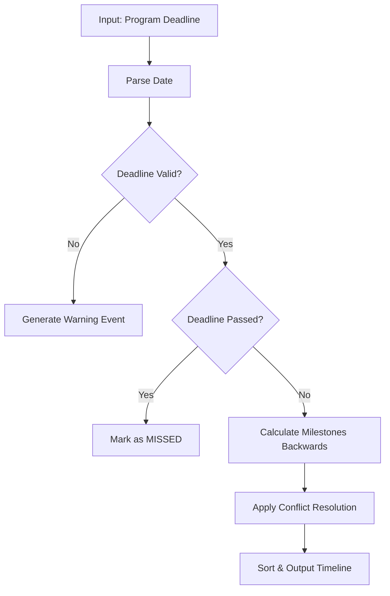
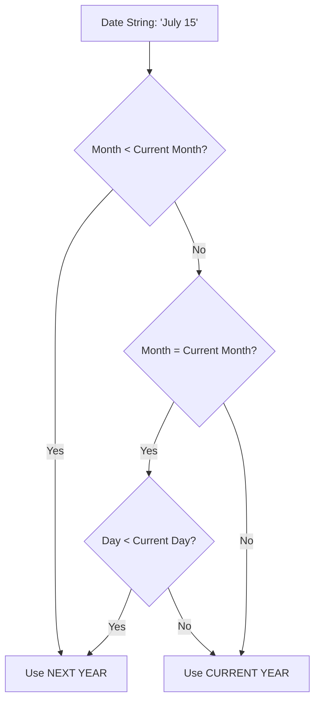
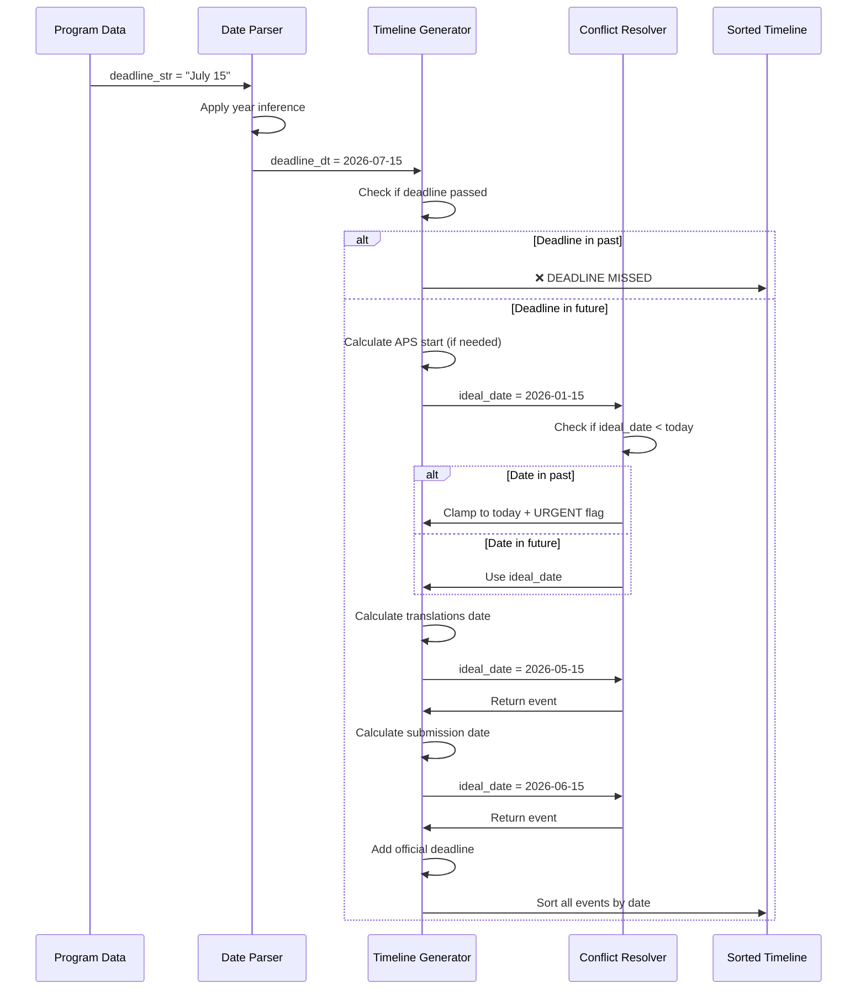
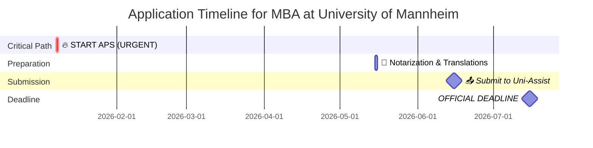

# Agent 5: Timeline & Strategy Planner - Logic Documentation

## Executive Summary

Agent 5 generates **backward-scheduled application timelines** that automatically adapt to the student's current situation. The system calculates ideal milestone dates working backwards from the application deadline, then intelligently resolves conflicts when calculated dates fall in the past by clamping them to "today" and marking them as urgent.

---

## System Architecture

### Three-Layer Design



---

## Core Logic Components

### 1. Intelligent Date Parser

**Purpose**: Convert various deadline formats into standardized date objects with smart year inference.

**Supported Formats**:
- ISO format: `2025-07-15`
- Full month: `July 15`, `July 15, 2025`
- Abbreviated: `Nov 30`, `Jan 15`
- European: `15.07.2025`
- Day-first: `15 July 2025`

**Smart Year Inference Logic**:

When a deadline lacks a year (e.g., "July 15"), the system determines the year using this decision tree:



**Example** (Today = January 8, 2026):
- `"July 15"` → **July 15, 2026** (future this year)
- `"November 30"` → **November 30, 2026** (future this year)
- `"January 5"` → **January 5, 2027** (already passed this year)

---

### 2. Conflict Resolution Engine

**Problem**: When calculating backwards from a deadline, some ideal dates may fall in the past.

**Solution**: The `create_event()` function implements a **triage system**:

| Scenario | Action | Visual Marker |
|----------|--------|---------------|
| Calculated date is **in the past** | Clamp to **TODAY** + Mark as **URGENT** | 🔥 |
| Calculated date is **in the future** | Use ideal scheduled date | Standard icon |

**Example Scenario**:

> **Program**: Master in Computer Science  
> **Deadline**: March 1, 2026  
> **Today**: January 8, 2026  
> **Country**: Vietnam (requires APS)

**Calculation**:
- Ideal APS start = March 1, 2026 - 180 days = **September 3, 2025**
- **Conflict detected**: September 3, 2025 < January 8, 2026
- **Resolution**: 
  - Date → **January 8, 2026** (today)
  - Event → **🔥 URGENT: START APS PROCEDURE**
  - Description → *"You are behind schedule! (Ideally started on 2025-09-03). Apply immediately. Processing takes ~6 months."*

---

### 3. Milestone Generation Rules

The system generates milestones by working **backwards from the deadline** using these rules:

#### Rule 1: APS Procedure (Critical Path)
- **Trigger**: Country requires APS certification (Vietnam, China, India)
- **Timing**: **6 months (180 days)** before deadline
- **Rationale**: APS processing typically takes 4-6 months
- **Priority**: Critical

#### Rule 2: Document Preparation
- **Applies to**: All applications
- **Timing**: **2 months (60 days)** before deadline
- **Tasks**: Notarization, translations, apostille
- **Priority**: Task

#### Rule 3: Application Submission
- **Timing varies by application mode**:

| Application Mode | Buffer Period | Rationale |
|------------------|---------------|-----------|
| **Uni-Assist** or **VPD** | 30 days | Processing time for preliminary review |
| **Direct Application** | 3 days | Safety buffer for technical issues |

- **Priority**: Action

#### Rule 4: Official Deadline
- **Timing**: The actual deadline date
- **Type**: Hard deadline (non-negotiable)
- **Priority**: Deadline

---

## Timeline Generation Workflow

### Step-by-Step Process



---

## Real-World Example

### Scenario
- **Student**: Vietnamese citizen
- **Program**: MBA at University of Mannheim
- **Deadline**: July 15, 2026
- **Application Mode**: Uni-Assist
- **Today**: January 8, 2026

### Generated Timeline

| Date | Event | Type | Description |
|------|-------|------|-------------|
| **Jan 8, 2026** | 🔥 URGENT: START APS PROCEDURE | Overdue | You are behind schedule! (Ideally started on 2026-01-15). Apply immediately. Processing takes ~6 months. |
| **May 15, 2026** | 📝 Notarization & Translations | Task | Prepare documents for upload. |
| **Jun 15, 2026** | 📤 Submit to Uni-Assist | Action | Uni-Assist processing buffer (4 weeks). |
| **Jul 15, 2026** | 🏁 OFFICIAL DEADLINE | Deadline | Hard deadline for University of Mannheim. |

### Timeline Visualization



---

## Edge Cases & Error Handling

### Case 1: Deadline Already Passed

**Input**: Deadline = December 15, 2025 (Today = January 8, 2026)

**Output**:
```
❌ DEADLINE MISSED
Description: The deadline was 2025-12-15. Look for the next intake.
Type: fatal
```

**No other milestones are generated** - the student is directed to find alternative intakes.

---

### Case 2: Unparseable Deadline

**Input**: Deadline = "Rolling admission" or "TBD"

**Output**:
```
⚠️ Manual Check Required
Description: Could not parse deadline string: 'Rolling admission'
Type: warning
```

**Action Required**: Student must manually verify deadline with university.

---

### Case 3: Multiple Conflicting Dates

**Scenario**: Very tight deadline where ALL calculated dates are in the past.

**Example**:
- Deadline: February 1, 2026
- Today: January 25, 2026
- Country: Vietnam (requires APS)

**Generated Timeline**:
```
🔥 URGENT: START APS PROCEDURE     [2026-01-25] (Ideally: 2025-08-04)
🔥 URGENT: Notarization            [2026-01-25] (Ideally: 2025-12-01)
🔥 URGENT: Submit to Uni-Assist    [2026-01-25] (Ideally: 2026-01-01)
🏁 OFFICIAL DEADLINE               [2026-02-01]
```

**All tasks are marked urgent**, signaling the student needs immediate action on all fronts.

---

## Priority & Urgency System

### Event Type Classification

| Type | Icon | Meaning | Action Required |
|------|------|---------|-----------------|
| **fatal** | ❌ | Deadline missed | Find next intake |
| **overdue** | 🔥 | Behind schedule | Immediate action needed |
| **critical** | 🚨 | High priority task | Start ASAP |
| **action** | 📤 | Submission milestone | Complete by date |
| **task** | 📝 | Preparation work | Schedule completion |
| **deadline** | 🏁 | Hard deadline | Non-negotiable |
| **warning** | ⚠️ | Manual verification needed | Contact university |

---

## Design Principles

### 1. **Realism Over Idealism**
The system never shows impossible dates. If a milestone has passed, it's clamped to "today" with clear urgency indicators rather than showing a past date that cannot be acted upon.

### 2. **Context-Aware Scheduling**
Different application modes (Uni-Assist vs. Direct) and country requirements (APS vs. non-APS) trigger different timeline rules, ensuring recommendations are tailored to the specific situation.

### 3. **Progressive Disclosure**
Events are sorted chronologically and visually coded by urgency, allowing students to quickly identify what needs immediate attention versus future planning.

### 4. **Fail-Safe Defaults**
When date parsing fails or data is missing, the system generates warning events rather than crashing, ensuring students are always notified of issues.

### 5. **Transparent Communication**
Overdue events explicitly state the ideal start date in the description, helping students understand how far behind schedule they are and make informed decisions.

---

## Integration with Agent Workflow

### Input from Agent 4
Agent 5 receives from Agent 4:
- `program_name`: e.g., "MBA in Business Administration"
- `university_name`: e.g., "University of Mannheim"
- `checklist_data`:
  - `deadline`: e.g., "July 15"
  - `application_mode`: e.g., "Uni-Assist"
  - `country_specific_requirement`: e.g., "APS certificate required"
  - `document_checklist`: List of required documents

### Output to Agent 6
Agent 5 provides to Agent 6:
- `final_application_plans`: Array of plan objects containing:
  - `program_name`
  - `university`
  - `official_url`
  - `timeline`: Sorted array of milestone events
  - `checklist`: Document requirements

Agent 6 then formats this data into a PDF report for the student.

---

## Calculation Reference Table

### Standard Timeline Offsets

| Milestone | Offset from Deadline | Days | Condition |
|-----------|---------------------|------|-----------|
| APS Start | 6 months before | -180 | APS required |
| Document Prep | 2 months before | -60 | Always |
| Submit (Uni-Assist) | 1 month before | -30 | Uni-Assist/VPD mode |
| Submit (Direct) | 3 days before | -3 | Direct application |
| Deadline | 0 days | 0 | Always |

### Date Arithmetic Examples

**Deadline**: July 15, 2026

| Milestone | Calculation | Result |
|-----------|-------------|--------|
| APS Start | 2026-07-15 - 180 days | **January 15, 2026** |
| Translations | 2026-07-15 - 60 days | **May 16, 2026** |
| Submit (Uni-Assist) | 2026-07-15 - 30 days | **June 15, 2026** |
| Submit (Direct) | 2026-07-15 - 3 days | **July 12, 2026** |

---

## Conclusion

Agent 5's timeline logic provides **intelligent, adaptive scheduling** that:

✅ Automatically adjusts to the student's current situation  
✅ Clearly communicates urgency when behind schedule  
✅ Accounts for country-specific requirements (APS)  
✅ Provides appropriate buffers based on application mode  
✅ Handles edge cases gracefully with clear warnings  

The backward-scheduling approach ensures students always know their **next actionable step**, while the conflict resolution system prevents confusion from showing impossible past dates. This creates a realistic, actionable roadmap for each application.
